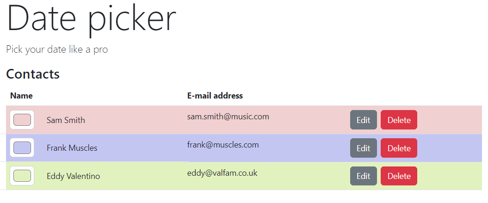

# Lab 1: Getting started



## Exercise 1: create the project

1. Install git from http://git-scm.com/. When asked about "Adjusting your PATH environment", select "Run Git from the Windows Command Prompt".
1. Install Node.js from http://nodejs.org/.
1. Run these commands in the directory you want to create your project:

```bash
# install the angular command line interface
npm install --global @angular/cli

# generate new project and go to newly created directory
# we recommend pnpm as package manager, but all the other ones are fine for this course
ng new date-picker --package-manager pnpm

# Choose "tailwind" as css language
# Choose "No" for server side rendering

cd date-picker

# Optionally: add eslint
ng add @angular-eslint/schematics


# Optionally: Install DaisyUI (or another CSS library) and add it to the page:
npm i --save-dev daisyui@latest

# Now open `styles.css` and add the following line:
# @plugin 'daisyui';

# launches a web server and automatically refreshes when code changes
ng serve
```

## Exercise 2: Hello world

Using your favorite IDE (when in doubt, use [Visual Studio Code](https://code.visualstudio.com/)), replace the existing content of the main view by a simple data-binding expression that prints out "Hello world" on the page. You can find this view in `src/app/app.html`

```html
<div class="jumbotron">Hello {{name}}</div>
```

Open `app.ts`

This component has been implemented as an example, but we won't be needing any functionality provided.
Replace the whole content of the file with:

```ts
import { Component } from '@angular/core';

@Component({
  selector: 'app-root',
  templateUrl: './app.html',
})
export class App {
  name: string;
  constructor() {
    this.name = 'world!';
  }
}
```

Save the documents, switch to the browser and verify that it displays "Hello world!".

Congratulations! You've taken advantage of the components within Angular to data-bind a simple value of the screen. Now we really can start building our Date picker application.

## Exercise 3: Showing contacts

In this exercise, we add the basic functionality to manage our contacts.

Create a list of contacts:

```ts
export class App {
  contacts = [
    { id: 4, firstName: 'Sam', surname: 'Smith', email: 'sam.smith@music.com' },
    { id: 8, firstName: 'Frank', surname: 'Muscles', email: 'frank@muscles.com' },
    { id: 15, firstName: 'Eddy', surname: 'Valentino', email: 'eddy@valfam.co.uk' },
  ];
}
```

Open `app.html`. Use `@for` to loop over the contacts and display them in a table and add a button for editing and deleting the contact.

```html
<div class="container">
  <h1 class="display-1">Date picker</h1>
  <p class="lead">Pick your date like a pro</p>
  <h3>Contacts</h3>
  <table class="table">
    <thead>
      <tr>
        <th>Name</th>
        <th colspan="2">E-mail address</th>
      </tr>
    </thead>
    <tbody>
      @for (contact of contacts; track contact.id) {
      <tr>
        <td class="row align-items-center">
          <div class="col-auto">
            <input class="form-control form-control-color" type="color" value="#ffffff" />
          </div>
          <div class="col-auto">{{contact.firstName}} {{contact.surname}}</div>
        </td>
        <td>{{contact.email}}</td>
        <td>
          <button class="btn btn-secondary me-2">Edit</button>
          <button class="btn btn-danger">Delete</button>
        </td>
      </tr>
      }
    </tbody>
  </table>
</div>
```

Verify that your table is visible on the screen and displays the 3 contacts.

## Exercise 4: Deleting contacts - If time permits

Implement the functionality for the "Delete" button. You can use JavaScript's `splice()` function to accomplish this. For example:

```ts
this.contacts.splice(this.contacts.indexOf(contactToDelete), 1);
```

## Exercise 5: Contact color - If time permits

Implement the functionality to choose a color per contact using the `"color"` input.
