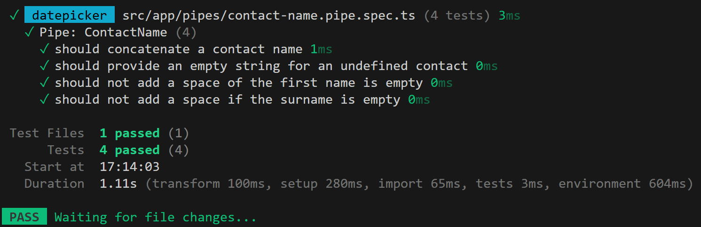
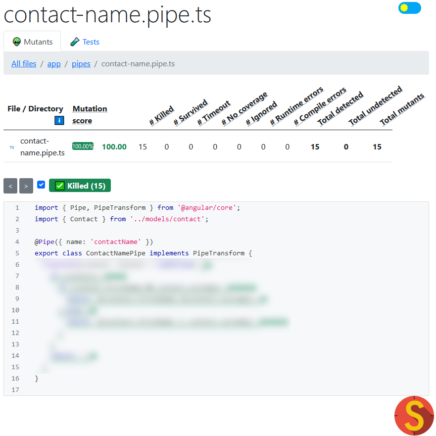

# Lab 4: Unit testing



Before we start, please delete the file `src/app/app.spec.ts`. This file contains unit tests that are now failing because we changed the contents of the `App`.

## Exercise 1: test the `ContactNamePipe`.

In this exercise, we would like to unittest our `ContactNamePipe`.

To do this, let's start by running Vitest:

```bash
ng test
```

By default, these tests will be executed in Node.js using JSDom. For this course, that suffices, but know that Vitest also supports testing in a real browser and that setup is often more desired.

Now then, let's create a unit test:

1. In `src/app/pipes/`, create a new file called `contact-name.pipe.spec.ts`
1. Add the skeleton: a `describe()`, `beforeEach()` and `it()`

   ```ts
   describe('Pipe: ContactName', () => {
     beforeEach(() => {});

     it('should concatenate a contact name', () => {});
   });
   ```

1. In the `beforeEach()`, create a new instance of `ContactNamePipe` and store this in a variable that can be used inside the `it()` function.
1. Our `ContactNamePipe` has only one function, `transform()`. Call this function within `it()`.
1. Define an expectation (`expect()`) of what the output should be depending on the input.

If all went well, your tests should now be succeeding.

Now write a couple more tests. What if data needs to be retrieved asynchronously and your `ContactNamePipe` receives `undefined` as input? Or an empty first name or surname?

## If time permits...

<span style="color: red;">This exercise is currently not doable. Stryker is currently working on Vitest support. Hopefully soon!</span>



Test your tests with mutation testing.

1.  Install and init StrykerJS.
    ```bash
    npm init stryker
    # Choose "none" and later "vitest"
    ```
1.  Run Stryker: `npx stryker run`.
1.  Inspect the HTML report it generates.

Try to improve your score to get 100% for the `contact-name.pipe.ts` file.
