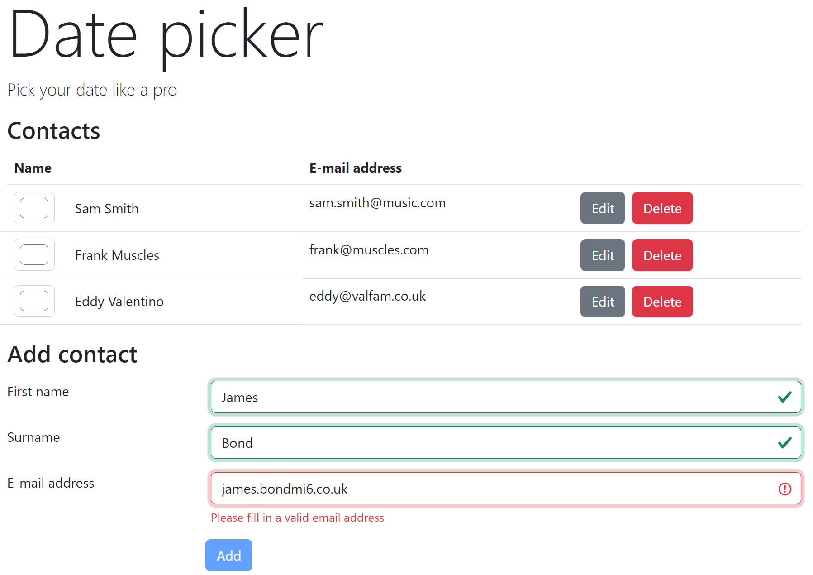

# Lab 6: Forms



In this lab, we'll add a form above the list of contacts for adding contacts to the list.

## Exercise 1: Add new contact form

1. Below the contact list table, create the 'Add contact' form.
   ```html
   <h3 class="mt-8 mb-3 text-2xl font-bold">Add contact</h3>
   <form novalidate autocomplete="off">
     <ol class="grid grid-cols-[min-content_1fr] gap-x-5 gap-y-2">
       <li class="col-span-3 grid grid-cols-subgrid items-center">
         <label for="input-name" class="label">First name</label>
         <div>
           <input id="input-name" class="input block" />
         </div>
       </li>
       ...
       <li><button class="btn btn-primary offset-md-3">Add</button></li>
     </ol>
   </form>
   ```
1. Add a `newContact` signal object, a signal for the form definition and an `addContact` method to `App`.

   ```ts
   export class App {
     // ...
     newContact = signal<Contact>({ id: 0, firstName: '', surname: '', email: '', color: '#ffffff' });
     addContactForm = form(this.newContact);

     addContact() {
       // TODO: Implement
     }
     // ...
   }
   ```

1. Bind the form fields to the properties in `newContact`.
1. Bind to the `(submit)` event of the `<form>` element and call the `addContact` method. Pass `$event` to be able to prevent the native form submit.
1. Implement the `addContact` method. It should update the contacts signal with the new contact.

Play around with it. Does it work as expected? If not, try to figure out what is going wrong and try to fix it.

## Exercise 2: Validation

1. Conditionally bind DaisyUI classes to the `<input>` fields based on Angular's metadata signals.
   ```html
   <input
     id="input-name"
     [field]="addContactForm.firstName"
     class="input block"
     [class.input-error]="addContactForm.firstName().errors().length > 0"
     [class.input-success]="addContactForm.firstName().errors().length === 0"
   />
   ```
1. In `App`, add validation to your form. `required`, `pattern`, `maxlength` and/or `minlength`
   ```ts
   addContactForm = form(this.newContact, p => {
     required(p.firstName, { message: 'First name is required' });
     // ...
   });
   ```
1. Your form now immediately shows these stylings as soon as the page is loaded. Play around with metadata signals `touched` and `dirty` to refine this behavior.

## Exercise 3: Disable the button on invalid

Bind the `disabled` property to `addContactForm().valid()`

```html
<button [disabled]="!addContactForm().valid()" class="btn btn-primary offset-md-3">Add</button>
```

## Exercise 4: Validation messages

<!-- prettier-ignore-start -->

1. Add validation message elements with an `@if` around them based on validation metadata signals.
   ```html
   @if (addContactForm.surname().errors().length > 0) {
     <div class="label">
       <span class="label-text-alt text-error"> {{ addContactForm.surname().errors()[0].message }} </span>
     </div>
   }
   ```
1. Validation messages should, of course, only be shown when the user has interacted with the input fields. Use the `dirty`/`touched` metadata signals in the `@if` to make it more user-friendly.

<!-- prettier-ignore-end -->

## Exercise 5: Reset the form after success

You are now able to add a new contact. However, after adding a contact, the form is not reset and the error messages show up right away. Let's fix that.

1. Call the `reset` function on the form definition after creating a new contact.
1. Reset the `newContact` signal.

Voila, the form should now be complete!

## If time permits...

Implement the functionality for the "Edit" buttons.

Using `@if` or `@switch`, display or hide input fields depending on whether a contact is in "edit mode".

> Tip: you need a way to determine which contact is in edit mode. You can do this by adding a property to every contact that determines if a contact is in edit mode, or by keeping a `Set<Contact>` collection of contacts that are in edit mode.
