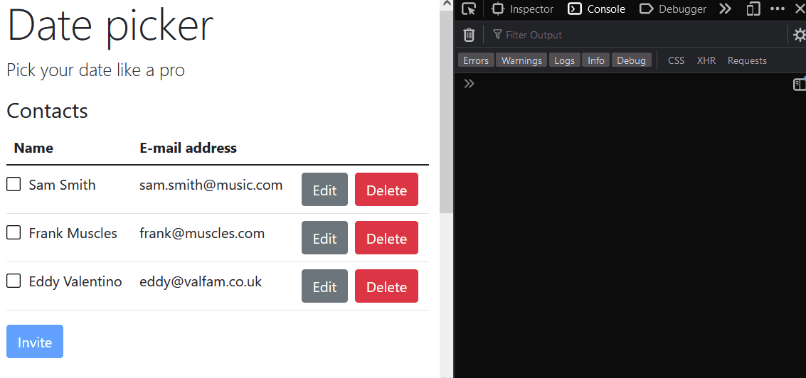

# Lab 15: Directives

We want the ability to select multiple contacts to be able to invite them to our party. For spectacular reasons, we want to make this ability generic, so that we can also use it in other places of our application. We will be using a directive for this, comparable to the `ngModel` directive. Let's call it `dpSelectable`.

The result should look like this:



The directive should have the following behavior:

- You can add it to any HTML element to make it "selectable".
- When you click on the HTML element (`'mousedown'`), it should mark it as 'selected'.
- When you click on the HTML element (`'mousedown'`) and it was already selected, it should be 'unselected'.
- When the element is selected, it should add the `'dp-selected'` and unselected should be the `'dp-unselected'`.
- It should emit a `selectionChange` event when a selection changes.
- Bonus: you should be able to select multiple items by hovering over an item (`mouseenter`) with the click mouse button down.

## Exercise 1: Create the `dpSelectable` directive.

In this exercise, we'll create the `dpSelectable` directive

1. Create or generate the directive. The file name should be called `selectable.directive.ts`. You can use this as a template:

   ```ts
   @Directive({ selector: '[dpSelectable]' })
   export class SelectableDirective {
     public selected = false;
     private el = inject(ElementRef);

     constructor() {
       // TODO
     }

     // TODO
     mouseDown() {
       // TODO
     }
   }
   ```

1. Add this directive to each row of the `contacts-list` table.
   ```html
   @for (contact of contacts; track contact.id) {
   <tr dpSelectable>
     ...
   </tr>
   }
   ```
1. Now register a `mousedown` listener in the directive. On mouse down:
   - Toggle the `selected` boolean.
   - Update the css classes of the element:
     - Add `'dp-selected'` when `selected` is `true`.
     - Add `'dp-unselected'` when `selected` is `false`.

   Verify that this behavior is working

1. Add some styling to the `contact-list` component to make selected contacts stand out:

   ```css
   td {
     background-color: unset;
   }

   .dp-selected {
     background-color: rgb(207, 226, 255);
   }

   .dp-unselected td:first-child {
     background-image: url('data:image/svg+xml;charset=UTF-8, <svg xmlns="http://www.w3.org/2000/svg" width="16" height="16" fill="currentColor" class="bi bi-square" viewBox="0 0 16 16"><path d="M14 1a1 1 0 0 1 1 1v12a1 1 0 0 1-1 1H2a1 1 0 0 1-1-1V2a1 1 0 0 1 1-1h12zM2 0a2 2 0 0 0-2 2v12a2 2 0 0 0 2 2h12a2 2 0 0 0 2-2V2a2 2 0 0 0-2-2H2z"/></svg>');
   }

   .dp-selected td:first-child {
     background-image: url('data:image/svg+xml;charset=UTF-8, <svg xmlns="http://www.w3.org/2000/svg" width="16" height="16" fill="currentColor" class="bi bi-check-square" viewBox="0 0 16 16"><path d="M14 1a1 1 0 0 1 1 1v12a1 1 0 0 1-1 1H2a1 1 0 0 1-1-1V2a1 1 0 0 1 1-1h12zM2 0a2 2 0 0 0-2 2v12a2 2 0 0 0 2 2h12a2 2 0 0 0 2-2V2a2 2 0 0 0-2-2H2z"/><path d="M10.97 4.97a.75.75 0 0 1 1.071 1.05l-3.992 4.99a.75.75 0 0 1-1.08.02L4.324 8.384a.75.75 0 1 1 1.06-1.06l2.094 2.093 3.473-4.425a.235.235 0 0 1 .02-.022z"/></svg>');
   }

   .dp-selected,
   .dp-unselected {
     cursor: cell;

     td:first-child {
       padding-left: 25px;
       background-repeat: no-repeat;
       background-position: 13px;
     }
   }
   ```

   Test it out, this should already look correct.

## Exercise 2: the `selectionChange` event

In this exercise, we will make our directive emit a `selectionChange` event. The event will be of type `SelectionChange`, which is handled in the `contact-list` component.

1. Add a `SelectionChange` interface. You may place it in the same file as the directive itself:
   ```ts
   export interface SelectionChange<T> {
     selected: boolean;
     subject: T;
   }
   ```
   _Note: we're using generics here to keep the `dpSelectable` loosely coupled from the `Contact` interface, yet allow for type-safe usage._
1. Add an `input()` binding for the subject in the `SelectableDirective`:
   ```ts
   export class SelectableDirective<T> {
     public subject = input.required<T>({ alias: 'dpSelectable' });
   }
   ```
   _Note: since our `subject` is of a generic type, we'll need to make the `SelectableDirective` class itself generic._
1. Add an `output()` to the for a new `selectionChange` event. It should emit values of type `SelectionChange<T>`.
1. Emit a new event each time the selection changes:
   ```ts
   this.selectionChange.emit({
     selected: this.selected,
     subject: this.subject,
   });
   ```
1. Now go back to the view of the `dp-contact-list` and bind each contact to the `dpSelectable` directive.
1. In the `ContactList`, keep a `Set<Contact>` to track the selected contacts. Attach the event handler for the `(selectionChange)` event and update the set. You can use this method to handle the events:

   ```ts
   export class ContactList {
     // [...]
     private selectedContacts = new Set<Contact>();
     updateSelection({ selected, subject }: SelectionChange<Contact>) {
       if (selected) {
         this.selectedContacts.add(subject);
       } else {
         this.selectedContacts.delete(subject);
       }
     }
   }
   ```

1. Test it out and see if your code works. You can `console.log()` the selected contacts whenever the selection changes.

## Exercise 3: the `selectContacts` event

Whenever the selection of contacts changes, the `contact-list` component should emit a `selectContacts` event which can be handled in the `ContactsPage`.

1. In the `contact-list` component, add a `selectContacts` event emitter of type `Set<Contact>`.
1. Emit the new event each time the selection was changed (using the `updateSelection` method).
1. Capture the event in the `ContactsPage` and add the set of selected contacts to a local attribute.
1. Add this new button to the app component (right under the `<dp-contact-list>`):
   ```html
   <button (click)="invite()" [disabled]="!selectedContacts.size" class="btn btn-primary mb-3">
     Invite @if (selectedContacts.size) {
     <span>({{selectedContacts.size}})</span>
     }
   </button>
   ```
1. Implement the invite method with a `console.log()` statement. We will be using this next lab to create a new invite.
1. Test it out. Updating the selection should update the number of selected contacts in the button. Clicking the button should log the contacts being 'invited'.

## ... if time permits

There is still work to be done:

1. Testing
   - Write integration tests for the directive
   - Update integration tests for the `dp-contact-list` component
1. Make it so that you can select more than 1 contact at a time by holding the mouse button and hovering over other `dpSelectable` elements. You can use `mouseenter` for that.
