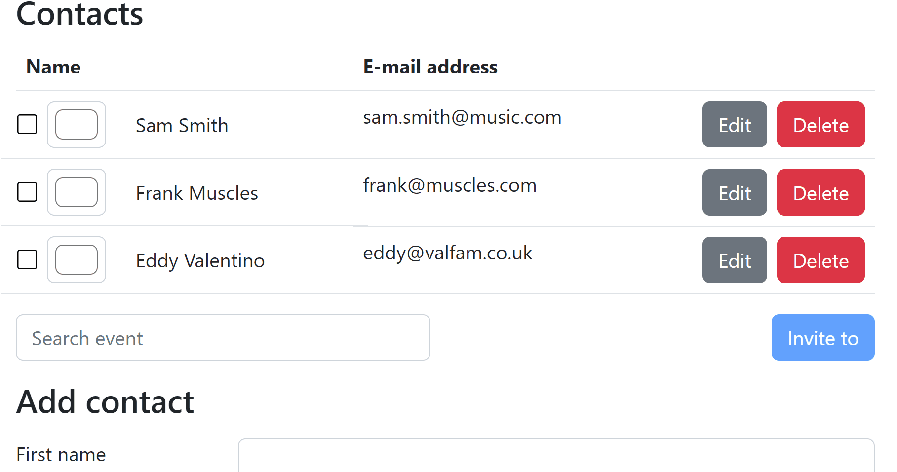

# Lab 16: Reactivity



## Preparations

Add some more events to your database. Open up the `date-picker.json` file and add these:

```json
{ "name": "DND rule discussion","start": "2023-04-30T09:00","end": "2023-04-30T11:00","invitees": [], "id": 3 },
{ "name": "DND kick off session","start": "2023-05-04T09:00","end": "2023-05-05T09:00","invitees": [],"id": 4 },
{ "name": "Choose DND box art","start": "2023-05-10T22:00","end": "2023-05-10T23:00","invitees": [],"id": 5 }
```

Be sure to also delay the json-server a bit. Stop the `npm start` command, and run both start commands in a separate shell. Delay the backend using `--delay`.

- `npm run start:ng`
- `npm run start:server -- --delay 500`

## Exercise 1: Event autocomplete

On the contacts page, it would be nice if we could select an event to invite our friends to. Let's create an input field with autocomplete functionality.

<!-- prettier-ignore-start -->

1. Generate a new component to select events: `ng g c contacts/event-selector --skip-tests`
1. Add the `<dp-event-selector>` to the `ContactsPage`, right in front of the invite button (if you've already finished that from the previous lab).
1. Add an event search input to the `event-selector.component.html` file. `[field]` is only for use inside `<form>`, but we can do a bit of manual plumbing:
   ```html
   <input class="input" placeholder="Search event" [value]="query()" (input)="query.set($event.target.value)" />
   ```
1. Open the `.ts` file and `query` signal to bind to:
   ```ts
   query = signal<string>('');
   ```
   We'll also be using RxJS to interact with our service, convert the signal into an `Observable`:
   ```ts
   query$ = toObservable(this.query);
   ```
   You should now be able to see the input on the screen.
1. Add a method to the `EventService` to search by event name. For example:

   ```ts
   export class EventService {
     search(query: { nameLike: string }): Observable<PlannedEvent[]> {
       const url = new URL(`${environment.backendUrl}/events`);
       url.searchParams.set('name_like', query.nameLike);
       return this.http.get<PlannedEvent[]>(url.href);
     }
   }
   ```

1. Back in the `EventSelectorComponent` class, add some plumbing to search on search input changes:

   ```ts
   export class EventSelectorComponent implements OnInit {
     private eventService = inject(EventService);
     searchChanged = output<PlannedEvent>();

     events?: PlannedEvent[];

     ngOnInit() {
       this.query$.subscribe(val => {
         this.eventService.search({ nameLike: val }).subscribe(events => {
           this.events = events;
         });
       });
     }
   }
   ```
1. Change the HTML so events are displayed as you type.
   ```html
   @if (events) {
     <ul class="menu dropdown-content bg-base-100 rounded-box z-1 w-52 p-2 shadow-sm">
       @for (event of events; track event.id) {
         <li>
           <button (click)="selected.emit(event)" class="dropdown-item">{{ event.name }}</button>
         </li>
       }
     </ul>
   }
   ```

<!-- prettier-ignore-end -->

Test it out. Events should be filtered on each keystroke! If you've chosen to go with a zoneless setup, you might get some funky results at this point where data appears to suddenly be shown at random. It's fixable by calling `markForCheck()`, or feel free to ask your trainer about this!

If you also have the invite button on the screen, you can bind them together. Whenever an event is selected `(clicked)` you can emit a `selected` event. Use that event in the `<dp-contacts-page>` to show the event name inside the invite button.

### Exercise 2: Implement quality-of-life improvements

The search already works... somewhat. But we can improve quite a lot using RxJS operators. Use https://rxjs.dev/ and the slides as inspiration and implement the following improvements:

1. First of all, you can see we're using a `.subscribe()` inside a `.subscribe()`. What is this? A pyramid? Rewrite the code with a `switchMap()` operator.
1. The search should only be done when you have typed a word of 2 letters or more.
1. To not send too many HTTP requests to the server, implement a delay of 500ms between type and search.
1. When we're dealing with a slow server, you don't want the user to be looking at old results. Clear the dropdown from the screen when a new search is started and show a fancy loading animation.

Maybe you can think of more improvements to be done?

### Exercise 3: Cleanup

Be sure to unsubscribe from the observable stream whenever the component gets destroyed. You can use one of the 3 ways you've found in the slides.
